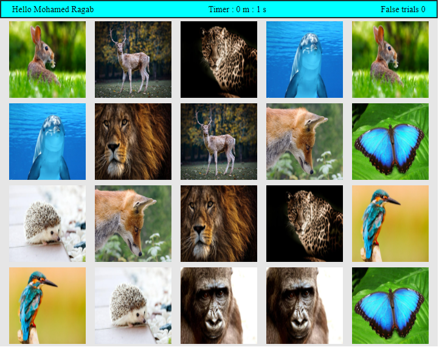

# Memory Match Game

## Description
Memory Match Game is a web-based game designed using HTML, CSS, and JavaScript. It presents users with a grid of 20 images arranged in a 5x4 layout. Each image is repeated twice. The game begins with all images visible for 3 seconds, allowing players to memorize their positions. After this brief period, the images are flipped, and players must select pairs of images. Matching pairs earn rewards, while non-matching pairs incur penalties.

## Example Images

  
  
  
  
  
  

## How to Play
1. Upon starting the game, all images are displayed for 3 seconds.
2. After the initial display, the images are flipped face down.
3. Players must select two images by clicking on them.
4. If the selected images match, they remain face up, and the player earns a reward.
5. If the selected images do not match, they are flipped face down again, and the player incurs a penalty.
6. The game continues until all image pairs have been successfully matched.

## Technologies Used
- HTML
- CSS
- JavaScript

## Usage
To play the game, simply open the `index.html` file in a web browser.

